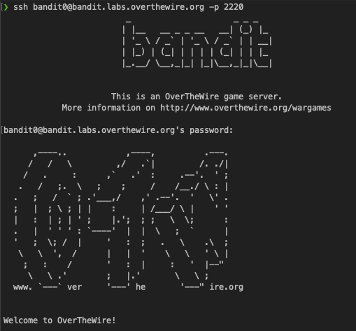
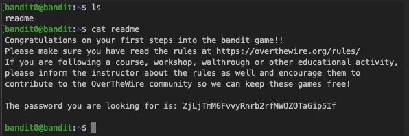

## Level Goal

The password for the next level is stored in a file called **```readme```**, located in the home directory. Use this password to log into bandit1 using SSH. Whenever you find a password for a level, use SSH (on port 2220) to log into that level and continue the game.

## Commands you may need to solve this level

[ls](https://manpages.ubuntu.com/manpages/noble/man1/ls.1.html) , [cd](https://manpages.ubuntu.com/manpages/noble/man1/cd.1posix.html) , [cat](https://manpages.ubuntu.com/manpages/noble/man1/cat.1.html) , [file](https://manpages.ubuntu.com/manpages/noble/man1/file.1.html) , [du](https://manpages.ubuntu.com/manpages/noble/man1/du.1.html) , [find](https://manpages.ubuntu.com/manpages/noble/man1/find.1.html)

**TIP:** Create a file for notes and passwords on your local machine!

Passwords for levels are _not_ saved automatically. If you do not save them yourself, you will need to start over from bandit0.

Passwords also occassionally change. It is recommended to take notes on how to solve each challenge. As levels get more challenging, detailed notes are useful to return to where you left off, reference for later problems, or help others after you’ve completed the challenge.

<b>Steps:</b>


In order to complete this part I need to open a simple SSH connection via terminal:

```sh
ssh bandit0@bandit.labs.overthewire.org -p 2220
```

Once connected, it will request the password (see on the description of this challenge).



Now the only thing remaining is to list the content of current directory and what what's inside. A readme file which can be read with the ```cat``` command.



passwd: ZjLjTmM6FvvyRnrb2rfNWOZOTa6ip5If
