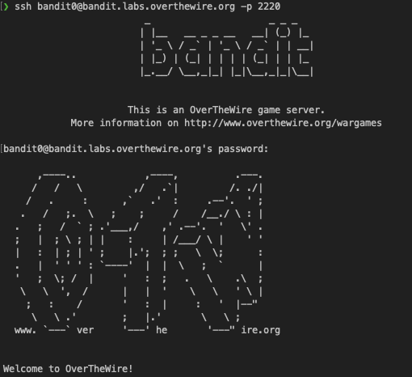
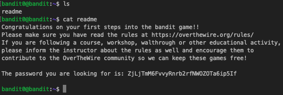

# Bandit0
Write Up of Bandit 0 challenfe in OverTheWire

## Level Goal

The goal of this level is for you to log into the game using SSH. The host to which you need to connect is **bandit.labs.overthewire.org**, on port 2220. The username is **bandit0** and the password is **bandit0**. Once logged in, go to the [Level 1](https://overthewire.org/wargames/bandit/bandit1.html) page to find out how to beat Level 1.

## Commands you may need to solve this level

[ssh](https://manpages.ubuntu.com/manpages/noble/man1/ssh.1.html)

## Helpful Reading Material

- [Secure Shell (SSH) on Wikipedia](https://en.wikipedia.org/wiki/Secure_Shell)
- [How to use SSH on wikiHow](https://www.wikihow.com/Use-SSH)

<b>Steps:</b>

In order to complete this part I need to open a simple SSH connection via terminal:

```sh
ssh bandit0@bandit.labs.overthewire.org -p 2220
```

Once connected, it will request the password (see on the description of this challenge).



Now the only thing remaining is to list the content of current directory and what what's inside. A readme file which can be read with the ```cat``` command.



passwd: ZjLjTmM6FvvyRnrb2rfNWOZOTa6ip5If
