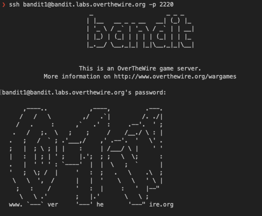
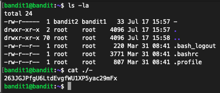

## Level Goal

The password for the next level is stored in a file called **```-```**, located in the home directory

## Commands you may need to solve this level

[ls](https://manpages.ubuntu.com/manpages/noble/man1/ls.1.html) , [cd](https://manpages.ubuntu.com/manpages/noble/man1/cd.1posix.html) , [cat](https://manpages.ubuntu.com/manpages/noble/man1/cat.1.html) , [file](https://manpages.ubuntu.com/manpages/noble/man1/file.1.html) , [du](https://manpages.ubuntu.com/manpages/noble/man1/du.1.html) , [find](https://manpages.ubuntu.com/manpages/noble/man1/find.1.html)

## Helpful Reading Material

- [Google Search for “dashed filename”](https://www.google.com/search?q=dashed+filename)
- [Advanced Bash-scripting Guide - Chapter 3 - Special Characters](https://linux.die.net/abs-guide/special-chars.html)

<b>Steps:</b>

In order to complete this part I need to open a SSH connection via terminal using as a user ```bandit1``` and as password the one discovered in the previous challenge (<b>bandit0</b>).

```sh
ssh bandit1@bandit.labs.overthewire.org -p 2220
```



Listing the folder content I see several files, one of them labeled as ```-```.
To read is, I made use of the following: ```cat ./-```



password: 263JGJPfgU6LtdEvgfWU1XP5yac29mFx

Here's a breakdown of the command:

- `cat`: This command is used to concatenate and display the contents of files.
- `./-`: This specifies the file `-` in the current directory. The `./` part means "in the current directory," and `-` is the actual file name.

Normally, the `-` character is often used as a special argument in Unix-like systems to represent standard input or output. However, when preceded by `./`, it is treated literally as a file named `-`.


